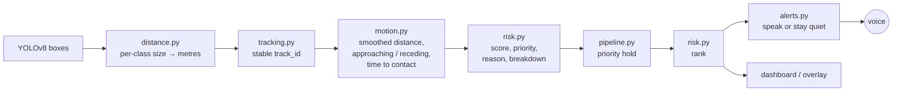

# Intelligent Hazard Prioritization

VISIONSTRA helps visually impaired people walk safely, so its voice has to say the **one thing that matters most right now**, not read out every box YOLO finds. This document explains how each detected object gets a risk score and a LOW / MEDIUM / HIGH priority, how objects are ranked, and when a warning is spoken. It also covers every weight and threshold, the assumptions behind them, and the known limitations.

> **The task example**: pedestrian 8 m, car 5 m, bike 2 m → LOW, MEDIUM, HIGH. The bike is the only warning spoken: *"Warning: bicycle ahead, 2 meters."*

---

## 1. How it fits together



All hazard logic lives in `backend/core/`. It is **pure Python** (no OpenCV, YOLO, NumPy or Flask), so it is unit-tested without a camera.

| Module | Responsibility |
|---|---|
| `hazard_config.py` | Every weight, threshold and timing, with JSON overrides and validation |
| `fields.py` | Reads both detection shapes in the repo (`object`/`distance_m` and `label`/`distance`) |
| `risk.py` | Stateless scoring, LOW/MEDIUM/HIGH, reason text, breakdown, ranking |
| `tracking.py` | Greedy IoU tracker, which gives each object a `track_id` across frames |
| `motion.py` | Trend of distance over time, movement label, time-to-contact |
| `pipeline.py` | `HazardPrioritizer`, one per camera stream: tracking → motion → scoring → hold → ranking |
| `alerts.py` | `AlertPolicy`: which hazard is spoken, and when; the spoken sentence |
| `distance.py` | Box → metres with per-class real-world sizes |

Integration points:

| Entry point | What it does |
|---|---|
| `detection /app.py` (live camera, port 5515) | Runs the pipeline on every frame, colours boxes by priority, speaks via pyttsx3, and serves `/detections`, `/alerts`, `/api/score` and `/test_demo` |
| `backend/app.py` (`POST /detect`, port 5510) | Runs the pipeline per browser tab (`stream_id`) and attaches `announcement` to the one hazard to speak |
| `frontend/js/app.js` | Draws boxes by priority and speaks `announcement` (a HIGH warning interrupts current speech) |

---

## 2. The score

```
score = type_weight
      + distance_points × distance_factor
      + position_points
      + movement_points
      + confidence_penalty
```

The raw sum is clamped to **0–100** and rounded to one decimal. Every result carries a `breakdown` with each of the five terms, so any score can be checked by hand.

### 2.1 Object type

Class names are matched after trimming and lower-casing.

| Group | Classes | Weight | Distance factor | Why |
|---|---|---|---|---|
| Vehicle | car, bus, truck, train, motorcycle | 34 | 1.0 | Can cause serious harm even at moderate distance |
| Bicycle | bicycle | 30 | 1.0 | Fast and quiet; at 2 m must outrank a car at 5 m |
| Person | person | 20 | 1.0 | Matters nearby; at 8 m stays LOW in every position |
| Rider equipment | skateboard, skis, snowboard, surfboard | 18 | 0.9 | Person-sized and moving, not a vehicle |
| Animal | dog, cat, horse, cow, sheep, bird, bear, elephant, zebra, giraffe | 16 | 0.8 | Unpredictable, usually less severe than a vehicle |
| Street obstacle | bench, chair, couch, potted plant, fire hydrant, parking meter, traffic light, stop sign, dining table | 12 | 0.55 | A trip or collision risk only when close and in the walking line |
| Any other class | bottle, cup, backpack, … | 4 | 0.25 | Must never take over the warning |
| No class name | missing, blank or not a string | 14 | 0.7 | The detector saw *something*; stay moderate |

The **distance factor** scales how much closeness matters. A bench 1 m away is a trip hazard, but not the same danger as a car 1 m away.

### 2.2 Distance

| Distance | Points (before factor) | Words in the reason |
|---|---|---|
| ≤ 2 m | 44 | very close |
| ≤ 5 m | 26 | nearby |
| ≤ 8 m | 12 | at a moderate distance |
| ≤ 12 m | 6 | far |
| > 12 m | 2 | very far |
| missing, non-numeric, NaN, ±∞, ≤ 0, or a boolean | 20 | distance unknown |

A distance on a band edge belongs to the closer band (2 m → 44). When a smoothed distance from tracking exists, it is used instead of the single-frame estimate.

### 2.3 Position

| Position | Points |
|---|---|
| Center (the walking line) | 6 |
| Left / Right | 0 |
| Missing or unrecognised | 3 |

The centre push is kept small on purpose, so the task example gives the same priorities in every position.

### 2.4 Movement

| Movement (synonyms) | Points |
|---|---|
| approaching (closing) | +12 |
| stationary (still) | 0 |
| receding (moving away) | −8 |
| unknown | 0 |

Section 4 explains how movement is measured.

### 2.5 Detection confidence

| YOLO confidence | Points |
|---|---|
| ≥ 0.40, or not supplied | 0 |
| < 0.40 | −15 |

An unsure detection is **down-weighted, not hidden**: a real hazard the model is unsure about still shows up, but it cannot easily take over the voice.

### 2.6 Priority

| Rule | Priority |
|---|---|
| score ≥ 70 | **HIGH** |
| score ≥ 40 | **MEDIUM** |
| otherwise | **LOW** |
| **Imminent override**: approaching, time-to-contact ≤ 2.5 s, and not low-confidence | **HIGH**, whatever the score |

The override exists because points alone cannot capture speed. A car 10 m away closing at 7 m/s scores only 52 (MEDIUM), yet it arrives in about 1.5 s.

---

## 3. Worked examples

All of these are checked in `backend/tests/test_risk.py`.

| Object | Distance | Position | Movement | Calculation | Score | Priority |
|---|---|---|---|---|---|---|
| Person | 8 m | Left | – | 20 + 12 + 0 + 0 | 32.0 | LOW |
| Person | 8 m | – | – | 20 + 12 + 3 + 0 | 35.0 | LOW |
| Person | 8 m | Center | – | 20 + 12 + 6 + 0 | 38.0 | LOW |
| Car | 5 m | Left | – | 34 + 26 + 0 + 0 | 60.0 | MEDIUM |
| Car | 5 m | – | – | 34 + 26 + 3 + 0 | 63.0 | MEDIUM |
| Car | 5 m | Center | – | 34 + 26 + 6 + 0 | 66.0 | MEDIUM |
| Bicycle | 2 m | Left | – | 30 + 44 + 0 + 0 | 74.0 | HIGH |
| Bicycle | 2 m | – | – | 30 + 44 + 3 + 0 | 77.0 | HIGH |
| Bicycle | 2 m | Center | – | 30 + 44 + 6 + 0 | 80.0 | HIGH |
| Bicycle | 2 m | Center | approaching | 30 + 44 + 6 + 12 | 92.0 | HIGH |
| Bicycle, 30 % confidence | 2 m | Center | – | 30 + 44 + 6 − 15 | 65.0 | MEDIUM |
| Car | 5 m | Left | approaching | 34 + 26 + 0 + 12 | 72.0 | HIGH |
| Car | 5 m | Left | receding | 34 + 26 + 0 − 8 | 52.0 | MEDIUM |
| Car, 1.5 s to contact | 10 m | Left | approaching | 34 + 6 + 0 + 12 | 52.0 | **HIGH** (imminent) |
| Car | 12 m | Left | – | 34 + 6 | 40.0 | MEDIUM |
| Car | 13 m | Left | – | 34 + 2 | 36.0 | LOW |
| Car | unknown | Left | – | 34 + 20 | 54.0 | MEDIUM |
| Person | 2 m | Center | – | 20 + 44 + 6 | 70.0 | HIGH |
| Person | 2 m | Left | – | 20 + 44 + 0 | 64.0 | MEDIUM |
| Dog | 2 m | Center | – | 16 + 44×0.8 + 6 | 57.2 | MEDIUM |
| Bench | 2 m | Center | – | 12 + 44×0.55 + 6 | 42.2 | MEDIUM |
| Traffic light | 5 m | Center | – | 12 + 26×0.55 + 6 | 32.3 | LOW |
| Bottle | 2 m | Center | – | 4 + 44×0.25 + 6 | 21.0 | LOW |
| (no name) | 2 m | Center | – | 14 + 44×0.7 + 6 | 50.8 | MEDIUM |

Example reason texts:

> *Bicycle, 2 m, center, approaching. It is a bicycle; it is very close; it is in the walking line; it is getting closer.*
>
> *Car, 10 m, left, approaching. It is a vehicle; it is far; it is getting closer. Raised to HIGH: about 1.5 s until it reaches the camera.*
>
> *Car, 5 m, left. It is a vehicle; it is nearby; the detector is unsure (30% confidence).*

---

## 4. Movement and time-to-contact

There is no speed sensor, so movement is inferred from how an object's estimated distance changes over time.

1. **Tracking.** Each box is matched to the previous frame's box of the same class with the highest overlap (IoU ≥ 0.25). Each box is used once. An object unseen for more than 1 s is forgotten.
2. **Trend.** For each track, a least-squares line is fitted through the raw distances of the last **1.2 s**. Its slope is the closing speed.
3. **Evidence test.** The trend counts only when all three hold:
   - it stands out from the jitter around the line (slope ÷ standard error ≥ **3**);
   - speed ≥ **0.3 m/s**;
   - the object would cover its distance within **8 s**.

   Otherwise the object is *stationary*. At least 4 readings spanning 0.4 s are needed; before that, movement is unknown (0 points).
4. **Confirmation.** A switch to *approaching* or *receding* must hold for **0.4 s**. Falling back to *stationary* is immediate.
5. **Time to contact** = smoothed distance ÷ closing speed, reported only while approaching. It drives the imminent override.

Everything is measured in seconds, not frames, so the browser API (~3 fps) and the live camera (~15–30 fps) behave alike.

**Why not compare two frames?** For a person 12 m away, a 3-pixel wobble in box width is ±1.2 m. A frame-to-frame rule turned a person standing still at 8 m into "approaching": LOW became MEDIUM and was spoken. The simulation in `backend/tests/test_motion.py` models that jitter:

| Scenario (±3 px box jitter) | Result with the defaults |
|---|---|
| Still person at 8 and 12 m; 3.3, 10 and 30 fps; 8 s each | never approaching or receding (0 of 240 runs during tuning; the test suite also checks 4 m) |
| Person walking at 1.4 m/s from 10 m | detected in about 1.5 s at 3.3 fps and 0.8–0.9 s at 15–30 fps |
| Car at 10 m/s from 30 m | detected in about 1.5 s at 3.3 fps and 0.8–0.9 s at 15–30 fps |

---

## 5. Distance estimation

Pinhole model: `distance = real_size × focal_length_px ÷ size_in_pixels`.

The original code assumed every object was 0.5 m wide. A car is about 1.8 m wide, so cars were estimated about **3.5× too close**: a car 7 m away read as 1.9 m and scored HIGH (78). `core/distance.py` now keeps a reference size for each class:

| Class | Width (m) | Height (m) | Class | Width (m) | Height (m) |
|---|---|---|---|---|---|
| person | 0.50 | 1.70 | dog | 0.30 | 0.60 |
| bicycle | 0.60 | 1.05 | cat | 0.20 | 0.30 |
| motorcycle | 0.80 | 1.15 | horse | 0.60 | 1.60 |
| car | 1.80 | 1.50 | cow | 0.70 | 1.40 |
| bus | 2.55 | 3.20 | sheep | 0.50 | 0.80 |
| truck | 2.50 | 3.00 | bench | 1.50 | 0.85 |
| train | 3.00 | 3.80 | chair | 0.50 | 0.90 |
| fire hydrant | 0.35 | 0.75 | stop sign | 0.75 | 0.75 |
| potted plant | 0.50 | 0.70 | *anything else* | 0.50 | – |

- **Height is preferred**, because it does not change when an object turns (a car seen side-on is 4.5 m long but still 1.5 m tall).
- If the box touches the top or bottom of the frame, the object is cut off, so **width** is used.
- If it is cut off on both axes, the **nearer** estimate is used (the safe side).
- Both apps now share this code and one focal length (700 px), so the same object gets the same distance everywhere.

**Calibrating a camera.** Stand an object of known size at a known distance, read its box size in pixels, and compute the focal length:

```python
from core.distance import calibrate_focal_length
calibrate_focal_length(pixel_size=175, distance_m=2.0, real_size_m=0.5)  # -> 700.0
```

Put the result in `camera.focal_length_px` (see section 8).

---

## 6. Ranking

Detections are sorted by:

1. higher **priority** (so a held HIGH stays above a MEDIUM that scores a point more);
2. higher **score**;
3. **nearer** distance (unknown distance last);
4. **center**, then left/right, then unknown position;
5. class name A–Z;
6. original detector order.

The order is deterministic: shuffling the input never changes the ranking (tested over every permutation of a 5-object scene). `rank` 1 is the primary hazard.

**Priority hold.** For tracked objects, a priority can rise immediately but falls only after staying lower for **1 s**. A person hovering around a cutoff therefore does not flicker HIGH, MEDIUM, HIGH. The item keeps its honest `risk_score` and adds `raw_priority`, `priority_held: true`, and a sentence in the reason.

---

## 7. Alerts: one voice, the right warning

Only the **rank-1** hazard can be spoken, and only one sentence per frame. `AlertPolicy` checks these rules in order:

1. Say nothing while speech is playing, for an empty frame, or when the top hazard is LOW.
2. **Escalation**: a priority higher than the last alert speaks at once.
3. **New HIGH object**: a HIGH hazard with a different `track_id` that has not been announced recently speaks at once (e.g. a bicycle appears right after a car warning).
4. Otherwise wait for the **cooldown** (3 s after a HIGH alert, 5 s after a MEDIUM), and never repeat the **same object** at the same or lower priority within **8 s**.

The decision never depends on the sentence text, so a distance jittering from 2.1 m to 1.9 m is not a "new" warning. Two HIGH objects that keep swapping rank 1 do not ping-pong, because each was announced recently.

Sentence format: *opener: name + direction, distance, movement. N more hazards nearby.*

| Situation | Spoken |
|---|---|
| Bicycle, 2 m, center, approaching | "Warning: bicycle ahead, 2 meters, approaching." |
| Car, 6.3 m, right, imminent, 2 other hazards | "Warning: car on your right, 6.5 meters, approaching fast. 2 more hazards nearby." |
| Car, 0.6 m, left, MEDIUM | "Caution: car on your left, less than 1 meter." |

Distances are rounded to 0.5 m under 10 m and to 1 m beyond, which is precise enough to act on and quick to hear. The live dashboard's **Spoken Alerts** panel lists what was actually said, via `/alerts`.

---

## 8. Configuration and tuning

All numbers above are defaults in `backend/core/hazard_config.py`. To change them without touching code, point `VISIONSTRA_HAZARD_CONFIG` at a JSON file that lists only the values to change (see `backend/hazard_config.example.json`):

```bash
VISIONSTRA_HAZARD_CONFIG=my_config.json python "detection /app.py"
```

```json
{
  "scoring": {"high_cutoff": 75, "type_groups": {"animal": {"weight": 20}}},
  "alerts":  {"cooldown_s": {"MEDIUM": 8}},
  "camera":  {"focal_length_px": 640}
}
```

The config is validated at start-up. Unknown keys and contradictions raise a clear `ValueError`, for example: a MEDIUM cutoff above HIGH, distance points that grow with distance, a class in two groups, or approaching worth less than receding.

| If you want… | Change |
|---|---|
| Fewer HIGH warnings overall | raise `scoring.high_cutoff` |
| One class to matter more | `scoring.type_groups.<group>.weight` (or add a group with its own `classes`) |
| Closeness to matter more for a group | `scoring.type_groups.<group>.distance_factor` |
| Earlier "imminent" warnings | raise `scoring.imminent_ttc_s` (`null` turns the rule off) |
| Motion detected faster (more false alarms) | lower `motion.min_t_stat`, `motion.confirm_s` or `motion.window_s` |
| Steadier motion (slower to react) | raise the same three |
| Quieter voice | raise `alerts.cooldown_s` / `alerts.same_object_repeat_s`, or set `alerts.speak_priorities` to `["HIGH"]` |
| Less flicker between priorities | raise `stability.downgrade_hold_s` |
| Accurate distances on your device | `camera.focal_length_px` (section 5) |

---

## 9. Output fields

Every ranked detection keeps its original keys (`object`/`label`, `distance_m`/`distance`, `direction`, `bbox`, `confidence`) and adds:

| Field | Meaning |
|---|---|
| `risk_score` | 0–100, one decimal |
| `priority` | LOW / MEDIUM / HIGH as shown and spoken (after the hold) |
| `raw_priority`, `priority_held` | priority from this frame alone, and whether the hold kept it higher |
| `rank` | 1 = primary hazard |
| `reason` | plain-English explanation |
| `breakdown` | `{type, distance, position, movement, confidence}` points |
| `category` | vehicle, bicycle, person, animal, street_obstacle, rider_equipment, other or unknown |
| `imminent` | true when the time-to-contact override made it HIGH |
| `track_id` | stable id across frames (null without a box) |
| `smoothed_distance_m` | distance after smoothing, used for scoring and speech |
| `movement`, `closing_speed_mps`, `time_to_contact_s` | motion estimate (when known) |
| `announcement` | `/detect` only: the sentence to speak, on at most one item |

`POST /api/score` scores one hypothetical object. It takes JSON `{name, distance, direction, movement, confidence, time_to_contact_s}` (all optional) and returns the score, priority, reason, breakdown and cutoffs. The `/test_demo` page is built on it.

---

## 10. Tests

```bash
python -m unittest discover -s backend/tests -v
```

These tests need no camera, model weights or network. `test_api.py` runs `POST /detect` with a fake YOLO model when Flask, OpenCV and NumPy are installed, and is skipped otherwise.

| File | Covers |
|---|---|
| `test_risk.py` | every worked example; the task scene in all positions; breakdown sums; reasons; confidence; the imminent rule; bad inputs (NaN, ∞, booleans, non-string names); consistency properties across 1,920 input combinations (closer / approaching / centre never lower the score, score always 0–100); every tie-break rule; config-driven scoring |
| `test_motion.py` | still objects never "move" under jitter (45 runs of 8 s); real approach and retreat are detected; time-to-contact; missing data |
| `test_tracking.py` | stable ids, no swaps, class changes, short gaps bridged and long gaps forgotten, bad boxes |
| `test_pipeline.py` | multi-frame behaviour, escalation of an approaching car, priority hold and flicker, reset |
| `test_alerts.py` | every speaking rule (first, escalation, new HIGH object, cooldown, same-object repeat, busy, jitter), sentence wording |
| `test_distance.py` | per-class distances, turned objects, cut-off boxes, calibration |
| `test_config.py` | overrides, file and env loading, the example file, 14 kinds of invalid config |
| `test_api.py` | `/detect` ranks the task scene, announces once per stream, keeps streams separate, rejects bad requests |

---

## 11. Assumptions

- The camera faces the direction of travel at roughly chest height and the image is not mirrored, so "left" in the image is the user's left.
- **Left / Center / Right** are thirds of the image (where the object *is*, not where it is heading).
- Class names are YOLOv8 COCO names. The reference sizes are typical adult / passenger-vehicle sizes.
- Distances are monocular estimates from box size. They are only as good as the reference size and the focal length.
- The voice can say only one hazard at a time. Everything else stays visible on screen.

## 12. Known limitations

- **Monocular distance is approximate.** An unusually sized object (a child, a van, a small dog), a sitting person, or a partly hidden object gets a biased distance. Calibrating the focal length removes the camera error, not the size error.
- **Band edges are steps.** A car at 12 m is MEDIUM (40.0) and at 13 m on the side LOW (36.0). This is intentional and kept small by the priority hold.
- **Position is only three zones**, and says nothing about the object's heading: a car driving *across* your path at 10 m is not "approaching".
- **Motion needs history.** Movement is unknown for roughly the first second of a new object, so a hazard that appears suddenly and close is ranked on type and distance alone. Its closeness already makes it HIGH in most cases.
- **The camera's own motion counts.** Walking towards a parked car makes it "approaching". From the user's point of view that is correct, but it is relative motion, not the car moving.
- **The tracker is simple.** It matches on overlap only. Two same-class objects that cross each other can swap ids, and a box lost for more than 1 s gets a new id, so it may be announced again.
- **Low-confidence and odd classes are not hidden.** A bottle, or a 25 %-confidence detection, stays listed but LOW. Missed detections (false negatives) are not handled by scoring at all.
- The live camera app serves **one camera** and one voice. The `/detect` API keeps separate state for up to 16 browser tabs.
- **Face identity** does not affect risk.
